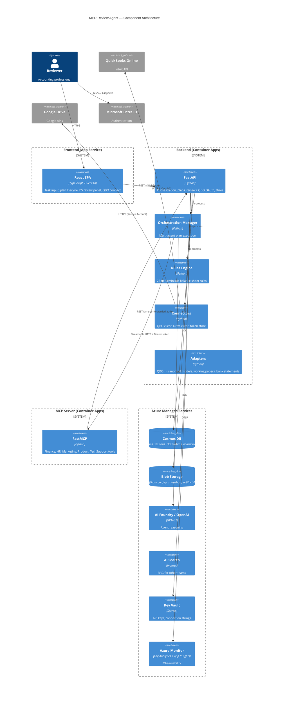

# Architecture — MER Review Agent

> **Status:** Living document
> **Confidence:** ✅ Verified in code unless otherwise tagged
> **See also:** [docs/architecture/architecture.md](../architecture/architecture.md) (full repo-derived architecture)

---

## Runtime Services

The system runs as three distinct services:

| Service | Technology | Port | Deployment Target |
|---|---|---|---|
| **Frontend** | React + TypeScript, served by FastAPI static | `:3000` | Azure App Service |
| **Backend** | FastAPI (Python) | `:8000` | Azure Container Apps |
| **MCP Server** | FastMCP (Python) | `:9000` | Azure Container Apps |

✅ *Verified in code:* `src/frontend/`, `src/backend/app.py`, `src/mcp_server/mcp_server.py`, `azure_custom.yaml`

---

## Component Diagram



✅ *Verified in code:* See also `docs/architecture/diagrams/architecture-c4.mmd`

---

## Backend Architecture

### Entry Point

The FastAPI application is composed in `src/backend/app.py`:

```
app.py
├── /api/v4/*      ← Orchestration, plans, teams, WebSocket (src/backend/v4/api/router.py)
├── /api/qbo/*     ← QBO OAuth + connectivity (src/backend/api/qbo.py)
├── /api/reviews/* ← Balance sheet runs, rules, snapshots (src/backend/api/reviews.py)
├── /api/drive/*   ← Google Drive evidence operations (src/backend/api/drive.py)
└── middleware      ← Auth, CORS, OpenTelemetry
```

✅ *Verified in code:* `src/backend/app.py`

### Orchestration Flow

1. User submits task → `POST /api/v4/process_request`
2. Backend creates plan in Cosmos DB
3. Frontend connects WebSocket at `GET /api/v4/socket/{process_id}`
4. User approves plan → `POST /api/v4/plan_approval`
5. `OrchestrationManager` executes agents sequentially per team config
6. Each agent invokes MCP tools as needed (via `src/backend/v4/magentic_agents/common/lifecycle.py`)
7. Real-time updates stream back via WebSocket (`AGENT_MESSAGE`, `PLAN_APPROVAL_REQUEST`, `FINAL_RESULT_MESSAGE`, etc.)

✅ *Verified in code:* `src/backend/v4/api/router.py`, `src/backend/v4/orchestration/orchestration_manager.py`

### Rules Engine (In-Process)

The rules engine lives at `src/backend/common/rules_engine/` and is **pure domain logic with zero IO**:

```
rules_engine/
├── models.py           ← RuleContext, RuleResult, RuleStatus, Severity, EvidenceBundle, etc.
├── rule.py             ← Rule ABC (base class)
├── registry.py         ← @register_rule decorator, RuleRegistry singleton
├── runner.py           ← RulesRunner — iterates registry, calls evaluate(), aggregates
├── config.py           ← ClientRulesConfig, per-rule typed configs
├── evidence_requirements.py ← Declares what evidence each rule needs
└── rules/              ← 26 rule implementations (one file each)
```

Invoked by `src/backend/api/reviews.py` which constructs a `RuleContext` from QBO adapter output + evidence bundles.

✅ *Verified in code:* `src/backend/common/rules_engine/`

### Adapters (Pure Functions)

Adapters transform raw external data into canonical Pydantic models:

| Layer | Location | Input | Output |
|---|---|---|---|
| QBO Balance Sheet | `adapters/qbo/balance_sheet.py` | QBO Report JSON | `BalanceSheetSnapshot` |
| QBO P&L | `adapters/qbo/profit_and_loss.py` | QBO Report JSON | `ProfitAndLossSnapshot` |
| QBO Accounts | `adapters/qbo/accounts.py` | QBO Accounts JSON | Account type/subtype map |
| QBO Aging Reports | `adapters/qbo/aging_reports.py` | QBO Aging JSON | Totals, over-60, detail rows |
| QBO Pipeline | `adapters/qbo/pipeline.py` | Multiple QBO payloads | Composed canonical types |
| Mock Evidence | `adapters/mock_evidence/` | JSON fixtures | `EvidenceBundle`, `ReconciliationSnapshot` |
| Working Papers | `adapters/working_papers/` | CSV files | Prepaid schedule, fixed asset register |
| Bank Statements | `adapters/bank_statements/` | CSV/PDF | Parsed bank data |

✅ *Verified in code:* `src/backend/common/adapters/`

### Connectors

| Connector | Location | Purpose |
|---|---|---|
| QBO Client | `src/backend/connectors/qbo/client.py` | OAuth token management, API calls to Intuit |
| QBO Token Store | `src/backend/connectors/qbo/token_store.py` | Cosmos DB persistence for OAuth tokens |
| QBO Reports | `src/backend/connectors/qbo/reports.py` | Fetch Balance Sheet, P&L, accounts, aging reports |
| Drive Client | `src/backend/connectors/drive/` | Google Drive file listing, download, evidence manifest |

✅ *Verified in code:* `src/backend/connectors/`

---

## MCP Server Architecture

The MCP server uses a **plugin/factory pattern**:

```
mcp_server.py (entry point)
├── MCPToolFactory         ← Aggregates all services, creates FastMCP instance
│   ├── FinanceService     ← 33 tools (QBO, balance sheet review, Drive)
│   ├── HRService          ← 7 tools (onboarding simulation)
│   ├── TechSupportService ← 5 tools (IT provisioning simulation)
│   ├── MarketingService   ← 2 tools (content generation)
│   └── ProductService     ← 1 tool (phone plans)
└── Auth: JWT validation (JWKS URI) if MCP_REQUIRE_USER_AUTH=true
```

**Critical design:** The MCP FinanceService is a **proxy layer** — it never calls QBO or Drive directly. All finance tools make HTTP calls back to the Backend API (`BACKEND_URL`), forwarding the user's bearer token. This keeps secrets server-side.

✅ *Verified in code:* `src/mcp_server/mcp_server.py`, `src/mcp_server/core/factory.py`, `src/mcp_server/services/finance_service.py`

🔍 *Inferred:* `DataToolService` and `GeneralService` exist in `src/mcp_server/services/` but are **not registered** in the entry point — they appear dormant/unused.

---

## Frontend Architecture

```
src/frontend/src/
├── pages/
│   ├── HomePage.tsx          ← Team init, task input, QBO connect
│   ├── PlanPage.tsx          ← Plan execution lifecycle (1113 lines, most complex)
│   ├── QboConnectPage.tsx    ← QBO OAuth start
│   └── QboCallbackPage.tsx   ← QBO OAuth callback
├── components/
│   ├── streaming/
│   │   ├── BalanceSheetReviewPanel.tsx ← Rich BS results UI (650 lines)
│   │   ├── StreamingAgentMessage.tsx   ← Agent message bubbles
│   │   └── StreamingPlanResponse.tsx   ← Plan approval UI
│   ├── QboConnectButton.tsx  ← QBO OAuth popover
│   └── QboStatusBanner.tsx   ← Connection warning banner
├── services/
│   ├── WebSocketService.tsx  ← Singleton WS client (auto-reconnect, heartbeat)
│   ├── PlanDataService.tsx   ← Backend DTO → frontend model transforms
│   ├── TaskService.tsx       ← Task CRUD + formatting
│   ├── TeamService.tsx       ← Team management + upload
│   └── QboReviewContextService.ts ← localStorage for client_id + period_end
├── hooks/
│   ├── useWebSocket.tsx      ← WS connection management
│   ├── useQboStatus.ts       ← QBO connection status polling
│   └── useTeamSelection.tsx  ← Team selection state
├── api/
│   ├── apiService.tsx        ← API singleton (all /api/v4/* calls, caching, dedup)
│   └── apiClient.tsx         ← fetchWithAuth / fetchWithoutAuth
└── models/                   ← TypeScript interfaces and enums
```

✅ *Verified in code:* `src/frontend/src/`

### Key Frontend Patterns

- **WebSocket-first** for plan execution — `PlanPage` registers 7 event listeners and manages 20+ state variables
- **QBO OAuth is popup-based** — connect opens in a new tab, callback communicates back via `postMessage` + `localStorage` events
- **Auto-reconnect** — WebSocket has exponential backoff (max 8 attempts) and 25s heartbeat
- **Message deduplication** — prevents duplicate agent messages on WS reconnect
- **In-memory caching** — `APIService` uses TTL cache (30s for plans) and request deduplication

---

## Agent Roles (Balance Sheet Review Team)

✅ *Verified in code:* `data/agent_teams/balance_sheet_review_team.json` (2026-03-02)

| Agent | Model | MCP Tools | Role |
|---|---|---|---|
| **ReviewAgent** | `gpt-4.1` | ✅ (33 tools) | Full review pipeline. Calls `run_balance_sheet_review` for the synchronous pipeline, plus has access to all QBO data query tools, layered pipeline tools, Drive evidence tools, and snapshot/artifact tools. Returns compact JSON. |
| **ProxyAgent** | — | ✗ | Human-in-the-loop clarification. Relays questions via WebSocket. No model, no tools. |

> **Architectural note:** The layered MCP tools (`bs_fetch_data`, `bs_normalize_data`, `bs_run_rules`) and direct QBO query tools (`qbo_get_trial_balance`, `qbo_get_gl_detail`, etc.) are registered and available but currently unused by the ReviewAgent’s system prompt, which directs it to call only `run_balance_sheet_review` (monolithic) or `get_balance_sheet_review` (follow-up). See [Agent Team Evolution Proposal](agent-team-evolution-proposal.md) for the planned multi-agent architecture.

---

## Boundaries

| Boundary | Constraint |
|---|---|
| Frontend ↔ Backend | REST + WebSocket only; no direct external API access from frontend |
| Backend ↔ MCP | Streamable HTTP with forwarded bearer token; MCP is stateless |
| MCP ↔ Backend (fan-out) | MCP finance tools call backend REST APIs, not external systems |
| Rules Engine | Pure domain logic, zero IO; all data arrives via `RuleContext` |
| Adapters | Pure functions: raw JSON/CSV → Pydantic models, no side effects |
| Secrets | Server-side only; Key Vault + Cosmos; never in frontend or client-side |

✅ *Verified in code:* `docs/architecture/controls.md`, `src/mcp_server/services/finance_service.py`

---

## Azure Resource Topology

Deployed via Bicep (`infra/main.bicep`):

| Resource | Type | Purpose |
|---|---|---|
| Container Apps Environment | Shared env | Hosts Backend + MCP containers |
| Backend Container App | Container App | API, orchestration, rules engine |
| MCP Container App | Container App | Tool server |
| Frontend Web App | App Service | React SPA + static server |
| AI Foundry / OpenAI | Cognitive Services | Agent reasoning (GPT-4.1) |
| AI Search | Search Service | RAG indexes for other teams |
| Cosmos DB | NoSQL | Plans, sessions, QBO tokens, review runs |
| Blob Storage | Storage Account | Team configs, snapshots, artifacts |
| Key Vault | Secrets | API keys, connection strings |
| ACR | Container Registry | Docker images |
| Log Analytics + App Insights | Monitoring | Telemetry, traces, diagnostics |
| Managed Identity | User-assigned | Cross-service auth |

✅ *Verified in code:* `infra/main.bicep`, `docs/architecture/architecture.md`, `docs/architecture/diagrams/deployment-azure.mmd`

🔍 *Inferred:* Optional private networking (VNet, private endpoints, Bastion, Jumpbox) is configurable but not enabled by default.
