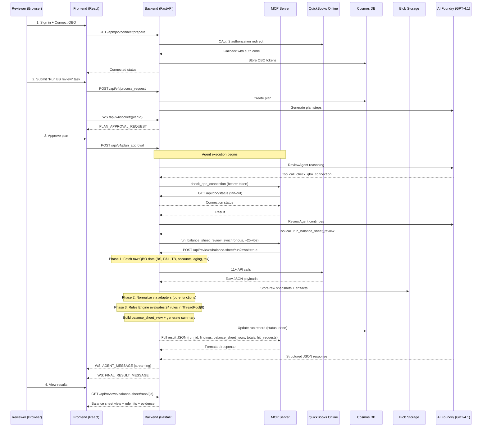

# Data Flow — MER Review Agent

> **Status:** Living document
> **Confidence:** ✅ Verified in code unless otherwise tagged

---

## Overview

The MER Review Agent processes financial data through a well-defined pipeline: external data acquisition → normalization → deterministic rule evaluation → structured reporting. Every stage has clear inputs and outputs.

---

## End-to-End Sequence



---

## Inputs

### Primary Data Sources

| Source | What's Pulled | Auth Method | Code Location |
|---|---|---|---|
| **QBO Balance Sheet** | Multi-period balance sheet report (current + 3 prior) | OAuth2 (user token) | `src/backend/connectors/qbo/reports.py` |
| **QBO Accounts** | Chart of Accounts with types/subtypes | OAuth2 | `src/backend/connectors/qbo/reports.py` |
| **QBO Aging Reports** | AP/AR aging summary + detail | OAuth2 | `src/backend/connectors/qbo/reports.py` |
| **QBO P&L** | Profit & Loss totals | OAuth2 | `src/backend/connectors/qbo/reports.py` |
| **QBO Trial Balance** | Account balances | OAuth2 | `src/backend/connectors/qbo/reports.py` |
| **QBO Transaction Lists** | Register details for reconciliation | OAuth2 | `src/backend/connectors/qbo/reports.py` |

✅ *Verified in code:* `src/backend/connectors/qbo/`, `src/mcp_server/services/finance_service.py`

### Supporting Evidence (MVP2 — Planned)

| Source | What's Provided | Auth Method | Status |
|---|---|---|---|
| **Google Drive** | Bank statements, petty cash docs, loan schedules, working papers | Service account | 🔍 Connector code exists (`src/backend/connectors/drive/`), full integration is MVP2 |
| **Manual Upload** | Evidence files uploaded by reviewer | User session | ⚠️ Needs verification |
| **Working Papers** | Prepaid schedule, fixed asset register (CSV) | Local/Drive | ✅ Adapters exist (`src/backend/common/adapters/working_papers/`) |

### Configuration

| Config | Location | What It Controls |
|---|---|---|
| Client mapping | `config/clients.json` | Client name → QBO realm_id + counterparties + Drive folder IDs |
| Team config | `data/agent_teams/balance_sheet_review_team.json` | Agent definitions, system prompts, model selection |
| Rule configs | Per-client overrides via `ClientRulesConfig` | Enable/disable rules, set thresholds, tolerance |
| Environment vars | `src/backend/.env.example`, `src/backend/.env.qbo` | QBO credentials, Azure resources, auth flags |

✅ *Verified in code:* `config/clients.json`, `src/backend/common/rules_engine/config.py`

---

## Processing Pipeline

### Stage 1: Data Acquisition (ReviewAgent → `run_balance_sheet_review`)

```
ReviewAgent calls run_balance_sheet_review(client_id, period_end)
→ MCP forwards to POST /api/reviews/balance-sheet/run?await=true
→ Backend starts synchronous pipeline:
  Phase 1: QBO API → Raw JSON payloads → Blob Storage (snapshots) + Cosmos DB (run record)
  Phase 2: Raw JSON → Adapters (pure functions) → Canonical Pydantic Models → Blob Storage (artifacts)
  Phase 3: RuleContext → RulesRunner (24 rules, ThreadPool 8) → RuleRunReport + balance_sheet_view
→ Returns full result JSON to ReviewAgent
```

- All three phases execute in a single synchronous call (~25-45s)
- QBO reports are fetched via `src/backend/connectors/qbo/reports.py`
- Raw JSON responses are stored as snapshots in Blob Storage for auditability
- Review run metadata is stored in Cosmos DB with status tracking

### Stage 2: Normalization (Adapters)

```
Raw JSON → Adapters (pure functions) → Canonical Pydantic Models
```

| Adapter | Input | Output Model |
|---|---|---|
| `adapters/qbo/balance_sheet.py` | QBO Balance Sheet JSON | `BalanceSheetSnapshot` |
| `adapters/qbo/profit_and_loss.py` | QBO P&L JSON | `ProfitAndLossSnapshot` |
| `adapters/qbo/accounts.py` | QBO Accounts JSON | Account type/subtype map |
| `adapters/qbo/aging_reports.py` | QBO Aging JSON | Totals, over-60-day items, detail rows |
| `adapters/qbo/bank_cc_reconciliation.py` | QBO Reconciliation JSON | `ReconciliationSnapshot` |
| `adapters/qbo/pipeline.py` | Multiple QBO payloads | **Facade** — assembles all types |
| `adapters/mock_evidence/manifest.py` | JSON evidence manifest | `EvidenceBundle` |
| `adapters/working_papers/prepaid_schedule.py` | CSV | Prepaid schedule balance |
| `adapters/working_papers/fixed_asset_register.py` | CSV | Fixed asset register data |

✅ *Verified in code:* `src/backend/common/adapters/`

### Stage 3: Rule Evaluation (Rules Engine)

```
RuleContext (BalanceSheetSnapshot + EvidenceBundle + Config) → RulesRunner → RuleRunReport
```

The `RulesRunner` iterates through the `RuleRegistry` (26 rules), calling `evaluate(ctx)` on each. Every rule:
1. Loads its typed config from `ClientRulesConfig`
2. Early-exits if disabled (`NOT_APPLICABLE`)
3. Locates relevant accounts by account reference or name inference
4. Checks evidence availability (missing → `NEEDS_REVIEW` or per `missing_data_policy`)
5. Performs deterministic comparison/validation logic
6. Returns `RuleResult` with status, severity, summary, details, evidence_used

See [Rules Engine](rules-engine.md) for the full rule catalog.

### Stage 4: Report Generation (Orchestrator Final Answer)

```
RuleRunReport + BalanceSheetView → Executive Summary with balance_sheet_rows + findings + next_actions
```

The `balance_sheet_view` output contract includes:
- `period_columns`: current period + up to 3 prior period descriptors
- `accounts[]`: rows with `account`, `status`, `balances_by_period`, `rule_hits`
- `unmapped_findings`: non-account-scoped outcomes
- `totals`: aggregate pass/fail/warn/needs_review counts

✅ *Verified in code:* `docs/architecture/mer-review-agent-spec.md` §7

---

## Outputs

| Output | Format | Destination | Purpose |
|---|---|---|---|
| **Balance Sheet View** | JSON (via REST + WebSocket) | Frontend `BalanceSheetReviewPanel` | Multi-period BS with per-account status |
| **Rule Findings** | `RuleResult[]` JSON | Frontend (embedded in BS view) | Per-rule status, severity, summary, evidence |
| **Executive Summary** | Markdown/text | Chat stream (agent message) | Human-readable summary of review results |
| **Missing Evidence Requests** | JSON | Chat stream (HITL agent) | What evidence is needed and how to provide it |
| **Raw Snapshots** | JSON blobs | Blob Storage | Auditability — original QBO data |
| **Review Run Record** | JSON | Cosmos DB | Run metadata, status, timestamps |
| **MER Review Package** | Google Sheet | Google Sheets (MVP2) | ⚠️ Planned — shareable output for team review |

---

## Data Lineage / Evidence Traceability

```
QBO Balance Sheet Report
    ↓ (adapter: balance_sheet.py)
BalanceSheetSnapshot
    ↓ (used in RuleContext)
    ├── BS-BANK-CC-RECONCILED-THROUGH-PERIOD-END
    │       ↓ uses: statement_balance_attachment (evidence)
    │       ↓ produces: RuleResult(status=PASS/FAIL/WARN/NEEDS_REVIEW)
    │              ↓ cites: evidence_used[{type, source, ref}]
    ├── BS-UNDEPOSITED-FUNDS-ZERO
    │       ↓ checks: account balance == 0 (threshold from config)
    │       ↓ produces: RuleResult with detail per account
    ├── ... (24 more rules)
    └── aggregated into RuleRunReport
            ↓
        balance_sheet_view
            ↓ (API response)
        BalanceSheetReviewPanel (frontend)
            ↓ (UI rendering)
        Reviewer sees: account | status | 4 period balances | rule hits | evidence refs
```

Every `RuleResult` includes:
- `rule_id` — which rule produced the finding
- `status` / `severity` — deterministic outcome
- `summary` — human-readable explanation
- `details` — per-account breakdown
- `evidence_used` — references to the evidence items that informed the result

This chain ensures that every finding can be traced back to its source data.

✅ *Verified in code:* `src/backend/common/rules_engine/models.py` (`RuleResult` dataclass)

---

## State Storage

| Data | Storage | Retention | Access Pattern |
|---|---|---|---|
| QBO OAuth tokens | Cosmos DB | Until revoked/expired | Token store read/write per API call |
| Review runs (metadata) | Cosmos DB | ⚠️ Needs verification (TTL?) | Created on run start, polled until terminal |
| Plan/session state | Cosmos DB | `ORCHESTRATION_RUN_TTL_SECONDS` (env var) | Created per task, updated during execution |
| Raw QBO snapshots | Blob Storage | ⚠️ Needs verification | Written once, read during review |
| Team configs | Blob Storage + API | Persisted across sessions | Loaded at team init, uploadable |
| Client config | `config/clients.json` | File-based | Read at runtime |
| QBO review context | `localStorage` (frontend) | Browser session | Client_id + period_end selection |
